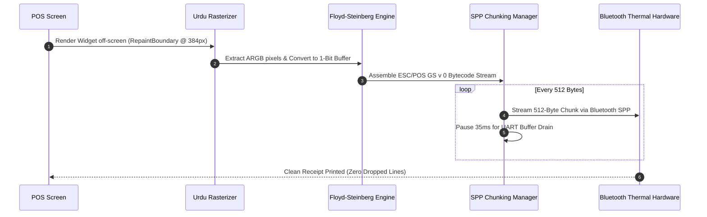

# Pakistan SME Billing & Business Management Platform
## Technical Architecture & Engineering Implementation Plan (Android-First)

---

## 1. System Vision & Architectural Paradigm

### 1.1 Target Platform Scope
*   **Primary Target**: **Android Mobile (Android 7.0+ / API Level 24 to Android 15+)**.
*   **Hardware Baseline**: Optimized for low-end devices prevalent in Pakistani bazaars (**2GB–3GB RAM Android Go** handsets like Infinix Smart, Tecno Pop, Itel, Redmi A-series).
*   **Secondary Target (Future Roadmap)**: Cross-platform code design structured to allow seamless deployment to iOS and Windows Desktop without core business logic refactoring.

### 1.2 Core Architectural Principles
```
┌──────────────────────────────────────────────────────────────────────────────────┐
│ CORE ARCHITECTURAL PRINCIPLES                                                    │
├──────────────────────────┬───────────────────────────────────────────────────────┤
│ **100% Offline First**   │ All CRUD operations execute against local SQLite in   │
│                          │ < 16ms. Zero external banking or payment API calls.   │
├──────────────────────────┼───────────────────────────────────────────────────────┤
│ **Zero Bank API Reliance**│ Payments (Cash, Bank, JazzCash, EasyPaisa, Raast, PDC)│
│                          │ are tracked 100% locally as internal ledger records.  │
├──────────────────────────┼───────────────────────────────────────────────────────┤
│ **Serverless Topology**  │ Zero proprietary backend server overhead. Cloud sync  │
│                          │ connects directly to user's Google Drive or OneDrive. │
├──────────────────────────┼───────────────────────────────────────────────────────┤
│ **Background Isolate DB**│ Database queries execute in a dedicated isolate via   │
│                          │ Drift NativeDatabase.createInBackground to guarantee  │
│                          │ 60 FPS UI performance on 2GB RAM Android Go devices.  │
├──────────────────────────┼───────────────────────────────────────────────────────┤
│ **Double-Entry Rigor**   │ User experiences simple single-entry UI while backend  │
│                          │ maintains an immutable, mathematically balanced GL.   │
├──────────────────────────┼───────────────────────────────────────────────────────┤
│ **Zero-Cost WhatsApp**   │ Direct Android OS Intents bypass Meta API charges.   │
├──────────────────────────┼───────────────────────────────────────────────────────┤
│ **Hardware Resilience**  │ Throttled 512-byte ESC/POS bitmap streaming prevents  │
│                          │ buffer overflow crashes on cheap thermal printers.    │
└──────────────────────────┴───────────────────────────────────────────────────────┘
```

---

## 2. High-Level System Architecture

```
┌─────────────────────────────────────────────────────────────────────────────────────────────┐
│                                   PRESENTATION LAYER (UI)                                   │
│  ┌────────────────────────┐  ┌─────────────────────────┐  ┌──────────────────────────────┐  │
│  │   Bilingual UI Views   │  │   Checkout / POS Screen │  │   Reports & Dashboards       │  │
│  │ (Urdu RTL / English)   │  │ (Cart, Scale, Discounts)│  │ (P&L, Tajir Dost 1%, Ledger) │  │
│  └────────────────────────┘  └─────────────────────────┘  └──────────────────────────────┘  │
└───────────────────────────────────────────────┬─────────────────────────────────────────────┘
                                                │ User Interactions & Streams
┌───────────────────────────────────────────────▼─────────────────────────────────────────────┐
│                                APPLICATION & STATE LAYER                                    │
│  ┌───────────────────────────────────────────────────────────────────────────────────────┐  │
│  │                     Riverpod 2.x Controllers & State Notifiers                        │  │
│  │  - CartController           - PartyLedgerController      - PDCController              │  │
│  │  - TaxCalculationNotifier   - CloudSyncNotifier          - PrinterConnectionNotifier  │  │
│  │  - LocalPaymentNotifier (Cash, Bank, Wallets, Khata)     - ScaleBarcodeNotifier       │  │
│  └───────────────────────────────────────────────────────────────────────────────────────┘  │
└───────────────────────────────────────────────┬─────────────────────────────────────────────┘
                                                │ Dispatches Use Cases & Commands
┌───────────────────────────────────────────────▼─────────────────────────────────────────────┐
│                                DOMAIN & BUSINESS LOGIC LAYER                                │
│  ┌───────────────────────┐  ┌────────────────────────┐  ┌────────────────────────────────┐  │
│  │ Double-Entry Compiler │  │ Tax Engine (FBR/Tajir) │  │ Hardware / Scale Parsers       │  │
│  │ (Journal Line Builder)│  │ (18% FBR, 3% Further)  │  │ (EAN-13 20-29, Keyboard Wedge) │  │
│  └───────────────────────┘  └────────────────────────┘  └────────────────────────────────┘  │
│  ┌───────────────────────┐  ┌────────────────────────┐  ┌────────────────────────────────┐  │
│  │ Offline QR Builder    │  │ PDC Legal State Mach.  │  │ Conflict Resolution Engine     │  │
│  │ (EMVCo Local Math)    │  │ (Sec 489-F PPC Notice) │  │ (Hybrid Logical Clocks / CRDT) │  │
│  └───────────────────────┘  └────────────────────────┘  └────────────────────────────────┘  │
└───────────────────────────────────────────────┬─────────────────────────────────────────────┘
                                                │ Background Isolate RPC / Query Streams
┌───────────────────────────────────────────────▼─────────────────────────────────────────────┐
│                            PERSISTENCE & STORAGE LAYER (LOCAL)                              │
│  ┌───────────────────────────────────────────────────────────────────────────────────────┐  │
│  │           Drift NativeDatabase.createInBackground (Dedicated Dart Isolate)            │  │
│  │  - SQLite 3.45+ (via sqlite3mc / Multiple Ciphers AES-256)                            │  │
│  │  - Write-Ahead Logging (WAL Mode)                 - PRAGMA synchronous = NORMAL       │  │
│  │  - Automatic DB Integrity Audits on Startup       - Strict Foreign Key Constraints    │  │
│  └───────────────────────────────────────────────────────────────────────────────────────┘  │
└──────────────────────┬───────────────────────────────────────────────────────┬──────────────┘
                       │ Local Delta Queue                                     │ Off-Screen Bitmap
┌──────────────────────▼────────────────────────┐       ┌──────────────────────▼──────────────┐
│       SERVERLESS & SYNC CONNECTORS            │       │       PERIPHERAL HARDWARE LAYER     │
│  - Google Drive REST API (appDataFolder)      │       │  - Bluetooth SPP (512-Byte Chunking)│
│  - Microsoft OneDrive Graph API (approot)     │       │  - USB OTG ESC/POS Thermal Printers │
│  - Local Wi-Fi P2P Sync (mDNS + Shelf Server) │       │  - Laser/CCD Barcode Scanners       │
│  - FBR DI Gateway Proxy (DI API v1.12)        │       │  - Electronic Weighing Scales       │
└───────────────────────────────────────────────┘       └─────────────────────────────────────┘
```

---

## 3. Subsystem Architecture Deep-Dive

### 3.1 Subsystem 1: Persistence & Background Isolate Architecture (Drift + SQLite3MC)

To guarantee that database writes never cause dropped frames on 2GB RAM budget devices, all database queries are isolated from the main UI thread using `NativeDatabase.createInBackground`.

#### Production Database Implementation (`app_database.dart`)
```dart
import 'dart:io';
import 'package:drift/drift.dart';
import 'package:drift/native.dart';
import 'package:path_provider/path_provider.dart';
import 'package:path/path.dart' as p;

part 'app_database.g.dart';

@DriftDatabase(tables: [
  Companies,
  Users,
  Parties,
  Items,
  Invoices,
  InvoiceItems,
  PostDatedCheques,
  Accounts,
  JournalEntries,
  JournalLines,
  Expenses,
  SyncQueue,
])
class AppDatabase extends _$AppDatabase {
  AppDatabase([QueryExecutor? e]) : super(e ?? _openConnection());

  @override
  int get schemaVersion => 1;

  @override
  MigrationStrategy get migration => MigrationStrategy(
    beforeOpen: (details) async {
      // 1. Enable Foreign Key Constraints
      await customStatement('PRAGMA foreign_keys = ON;');
      // 2. Enable Write-Ahead Logging for high-concurrency read/writes
      await customStatement('PRAGMA journal_mode = WAL;');
      // 3. Optimize synchronous writes
      await customStatement('PRAGMA synchronous = NORMAL;');
      // 4. Quick integrity check on startup
      final result = await customSelect('PRAGMA quick_check;').getSingle();
      if (result.data.values.first != 'ok') {
        throw StateError('Database corruption detected during startup quick_check.');
      }
    },
  );

  static QueryExecutor _openConnection() {
    return LazyDatabase(() async {
      final dbFolder = await getApplicationDocumentsDirectory();
      final file = File(p.join(dbFolder.path, 'app_database.sqlite'));

      // Dedicated Background Isolate Execution
      return NativeDatabase.createInBackground(
        file,
        setup: (rawDb) {
          // SQLCipher / SQLite3 Multiple Ciphers key configuration
          rawDb.execute("PRAGMA key = 'user_secure_derived_key';");
        },
      );
    });
  }
}
```

---

### 3.2 Subsystem 2: Local Payment Bookkeeping & Offline Merchant QR

All payments are recorded **100% locally** in the SQLite database. No external banking APIs, payment gateways, or webhooks are used.

#### Offline Merchant QR Generator (`offline_qr_engine.dart`)
Merchants enter their bank account IBAN, JazzCash Till Number, or EasyPaisa Number in the app settings **once**. The app draws the payment QR code on screen and prints it on thermal receipts locally using standard EMVCo tag formatting:

```dart
class OfflineQrEngine {
  static String formatTag(String tag, String value) {
    final len = value.length.toString().padLeft(2, '0');
    return '$tag$len$value';
  }

  /// Generates a local static or dynamic payment QR code with zero network calls
  static String generateMerchantQr({
    required String merchantIdentifier, // IBAN, JazzCash Till, or EasyPaisa Phone
    required String merchantName,
    required String merchantCity,
    double? amount,
    String? invoiceNumber,
  }) {
    final sb = StringBuffer();
    sb.write(formatTag('00', '01')); // Format
    sb.write(formatTag('01', amount != null ? '12' : '11')); // Dynamic or Static
    sb.write(formatTag('26', formatTag('00', 'pk.local') + formatTag('01', merchantIdentifier)));
    sb.write(formatTag('52', '5411')); // Retail MCC
    sb.write(formatTag('53', '586'));  // PKR
    if (amount != null) {
      sb.write(formatTag('54', amount.toStringAsFixed(2)));
    }
    sb.write(formatTag('58', 'PK'));
    sb.write(formatTag('59', merchantName.toUpperCase()));
    sb.write(formatTag('60', merchantCity.toUpperCase()));
    if (invoiceNumber != null) {
      sb.write(formatTag('62', formatTag('01', invoiceNumber)));
    }

    // CRC-16 Calculation
    sb.write('6304');
    final rawPayload = sb.toString();
    final crc = _calculateCRC16(rawPayload);
    final crcHex = crc.toRadixString(16).toUpperCase().padLeft(4, '0');
    return '$rawPayload$crcHex';
  }

  static int _calculateCRC16(String data) {
    int crc = 0xFFFF;
    const polynomial = 0x1021;
    for (int i = 0; i < data.length; i++) {
      int byte = data.codeUnitAt(i);
      for (int j = 0; j < 8; j++) {
        bool bit = ((byte >> (7 - j)) & 1) == 1;
        bool c15 = ((crc >> 15) & 1) == 1;
        crc = (crc << 1) & 0xFFFF;
        if (c15 ^ bit) {
          crc ^= polynomial;
        }
      }
    }
    return crc & 0xFFFF;
  }
}
```

---

### 3.3 Subsystem 3: Hybrid Logical Clock (HLC) for Zero-Server Multi-Counter Sync

To permit 2–4 counter tablets/phones to generate invoices and update ledgers simultaneously on a local Wi-Fi router without a central internet server, the system uses **Hybrid Logical Clocks (HLC)** to resolve write conflicts deterministically without timestamps skewing across unsynchronized device clocks.

#### Production HLC Implementation (`hlc.dart`)
```dart
class Hlc implements Comparable<Hlc> {
  final int millis;
  final int counter;
  final String nodeId;

  Hlc({required this.millis, required this.counter, required this.nodeId});

  factory Hlc.now(String nodeId) {
    return Hlc(
      millis: DateTime.now().millisecondsSinceEpoch,
      counter: 0,
      nodeId: nodeId,
    );
  }

  Hlc send() {
    final now = DateTime.now().millisecondsSinceEpoch;
    if (now > millis) {
      return Hlc(millis: now, counter: 0, nodeId: nodeId);
    }
    return Hlc(millis: millis, counter: counter + 1, nodeId: nodeId);
  }

  Hlc receive(Hlc remote) {
    final now = DateTime.now().millisecondsSinceEpoch;
    final maxMillis = [now, millis, remote.millis].reduce((a, b) => a > b ? a : b);

    if (maxMillis == millis && maxMillis == remote.millis) {
      return Hlc(millis: maxMillis, counter: [counter, remote.counter].reduce((a, b) => a > b ? a : b) + 1, nodeId: nodeId);
    } else if (maxMillis == millis) {
      return Hlc(millis: maxMillis, counter: counter + 1, nodeId: nodeId);
    } else if (maxMillis == remote.millis) {
      return Hlc(millis: maxMillis, counter: remote.counter + 1, nodeId: nodeId);
    }
    return Hlc(millis: maxMillis, counter: 0, nodeId: nodeId);
  }

  @override
  int compareTo(Hlc other) {
    if (millis != other.millis) return millis.compareTo(other.millis);
    if (counter != other.counter) return counter.compareTo(other.counter);
    return nodeId.compareTo(other.nodeId);
  }

  String toJson() => '$millis:$counter:$nodeId';

  factory Hlc.fromJson(String json) {
    final parts = json.split(':');
    return Hlc(
      millis: int.parse(parts[0]),
      counter: int.parse(parts[1]),
      nodeId: parts[2],
    );
  }
}
```

---

### 3.4 Subsystem 4: ESC/POS Thermal Printing & Floyd-Steinberg Dithering Engine



#### Production Dithering & ESC/POS Generator (`thermal_printer_engine.dart`)
```dart
import 'dart:typed_data';
import 'dart:ui' as ui;

class ThermalPrinterEngine {
  /// Converts an off-screen ui.Image into ESC/POS GS v 0 raster bytecode
  static Future<List<int>> imageToEscPosRaster(ui.Image image) async {
    final width = image.width;
    final height = image.height;
    final byteData = await image.toByteData(format: ui.ImageByteFormat.rawRgba);
    if (byteData == null) return [];

    final pixels = byteData.buffer.asUint8List();
    final widthBytes = (width + 7) ~/ 8;
    
    // 1. Grayscale buffer for Floyd-Steinberg error diffusion
    final gray = List<int>.filled(width * height, 0);
    for (int i = 0; i < width * height; i++) {
      final r = pixels[i * 4];
      final g = pixels[i * 4 + 1];
      final b = pixels[i * 4 + 2];
      gray[i] = (0.299 * r + 0.587 * g + 0.114 * b).round();
    }

    // 2. Floyd-Steinberg 1-Bit Dithering
    final monoBits = Uint8List(widthBytes * height);
    for (int y = 0; y < height; y++) {
      for (int x = 0; x < width; x++) {
        final idx = y * width + x;
        final oldPixel = gray[idx];
        final newPixel = oldPixel < 128 ? 0 : 255;
        gray[idx] = newPixel;
        final error = oldPixel - newPixel;

        if (x + 1 < width) gray[idx + 1] += (error * 7) >> 4;
        if (x - 1 >= 0 && y + 1 < height) gray[idx + width - 1] += (error * 3) >> 4;
        if (y + 1 < height) gray[idx + width] += (error * 5) >> 4;
        if (x + 1 < width && y + 1 < height) gray[idx + width + 1] += (error * 1) >> 4;

        if (newPixel == 0) {
          final byteIndex = y * widthBytes + (x ~/ 8);
          final bitOffset = 7 - (x % 8);
          monoBits[byteIndex] |= (1 << bitOffset);
        }
      }
    }

    // 3. Construct ESC/POS GS v 0 Command Header
    final List<int> bytes = [];
    bytes.addAll([0x1D, 0x76, 0x30, 0x00]); // GS v 0 m (m=0 normal)
    bytes.add(widthBytes & 0xFF);           // xL
    bytes.add((widthBytes >> 8) & 0xFF);    // xH
    bytes.add(height & 0xFF);               // yL
    bytes.add((height >> 8) & 0xFF);        // yH
    bytes.addAll(monoBits);
    
    // Line feed & cut commands
    bytes.addAll([0x1B, 0x64, 0x03]);       // Feed 3 lines
    bytes.addAll([0x1D, 0x56, 0x41, 0x00]); // Paper Cut
    return bytes;
  }

  /// Sends bytecode in 512-byte slices with throttled delays to prevent UART buffer overflow
  static Future<void> sendThrottled(
    List<int> bytes, 
    Future<void> Function(List<int> chunk) writeFunction,
  ) async {
    const chunkSize = 512;
    for (int i = 0; i < bytes.length; i += chunkSize) {
      final end = (i + chunkSize < bytes.length) ? i + chunkSize : bytes.length;
      final chunk = bytes.sublist(i, end);
      await writeFunction(chunk);
      await Future.delayed(const Duration(milliseconds: 35)); // Buffer drain delay
    }
  }
}
```

---

### 3.5 Subsystem 5: Scale Barcode & Keyboard Wedge Interceptors

#### Production Scale Barcode Parser (`scale_barcode_parser.dart`)
```dart
class ParsedScaleItem {
  final String plu;
  final double? weightInKg;
  final double? priceInRupees;

  ParsedScaleItem({required this.plu, this.weightInKg, this.priceInRupees});
}

class ScaleBarcodeParser {
  /// Decodes GS1 variable-measure barcodes (Prefixes 20-29)
  static ParsedScaleItem? parse(String rawCode) {
    if (rawCode.length != 13) return null;
    final prefix = rawCode.substring(0, 2);

    if (['20', '21', '22', '28'].contains(prefix)) {
      final plu = rawCode.substring(2, 7);
      final rawValue = int.tryParse(rawCode.substring(7, 12)) ?? 0;

      final isWeight = prefix == '20' || prefix == '21';
      return ParsedScaleItem(
        plu: plu,
        weightInKg: isWeight ? rawValue / 1000.0 : null, // 01500 -> 1.500 Kg
        priceInRupees: !isWeight ? rawValue / 100.0 : null,
      );
    }
    return null;
  }
}
```

---

## 4. Native Android Configuration & Permissions

### `android/app/src/main/AndroidManifest.xml`
```xml
<manifest xmlns:android="http://schemas.android.com/apk/res/android"
    xmlns:tools="http://schemas.android.com/tools"
    package="com.pakistan.billing.app">

    <!-- Android 12+ Bluetooth Permissions for Thermal Printers -->
    <uses-permission android:name="android.permission.BLUETOOTH_SCAN"
                     android:usesPermissionFlags="neverForLocation"
                     tools:targetApi="s" />
    <uses-permission android:name="android.permission.BLUETOOTH_CONNECT" />
    <uses-permission android:name="android.permission.BLUETOOTH_ADVERTISE" />

    <!-- Legacy Bluetooth for Android 11 and below -->
    <uses-permission android:name="android.permission.BLUETOOTH" android:maxSdkVersion="30" />
    <uses-permission android:name="android.permission.BLUETOOTH_ADMIN" android:maxSdkVersion="30" />

    <!-- USB OTG & Camera Barcode Permissions -->
    <uses-feature android:name="android.hardware.usb.host" android:required="false" />
    <uses-permission android:name="android.permission.CAMERA" />
    <uses-feature android:name="android.hardware.camera" android:required="false" />

    <!-- Internet for Cloud Sync & Background Work -->
    <uses-permission android:name="android.permission.INTERNET" />
    <uses-permission android:name="android.permission.ACCESS_NETWORK_STATE" />
    <uses-permission android:name="android.permission.RECEIVE_BOOT_COMPLETED" />

    <application
        android:label="Pakistan Billing"
        android:name="${applicationName}"
        android:icon="@mipmap/ic_launcher">
        <activity
            android:name=".MainActivity"
            android:exported="true"
            android:launchMode="singleTop"
            android:theme="@style/LaunchTheme"
            android:configChanges="orientation|keyboardHidden|keyboard|screenSize|smallestScreenSize|locale|layoutDirection|fontScale|screenLayout|density|uiMode"
            android:hardwareAccelerated="true"
            android:windowSoftInputMode="adjustResize">
            <intent-filter>
                <action android:name="android.intent.action.MAIN"/>
                <category android:name="android.intent.category.LAUNCHER"/>
            </intent-filter>
        </activity>
    </application>
</manifest>
```

---

## 5. Flutter Project Directory & File Structure

```
lib/
├── main.dart                          # Application entry point & native initialization
├── app.dart                           # Root MaterialApp, EasyLocalization, Theme config
├── core/
│   ├── constants/                     # Tax rates (FBR 18%), SBP currency codes (586)
│   ├── errors/                        # Failures, exceptions, error mapper
│   ├── localization/                  # En/Ur JSON files, RTL helpers, Nastaliq font config
│   ├── theme/                         # Light/Dark material theme & palette
│   └── utils/                         # Scale barcode parser, date formatters
├── data/
│   ├── database/
│   │   ├── app_database.dart          # Drift database class, connection, migrations
│   │   ├── daos/                      # InvoicesDao, ItemsDao, PartiesDao, PdcDao, LedgerDao
│   │   └── tables/                    # Modular Drift table definitions
│   ├── models/                        # DTOs, JSON mappers
│   └── repositories/                  # Implementation of domain repositories
├── domain/
│   ├── entities/                      # Clean business models (Invoice, Item, Party, PDC)
│   ├── repositories/                  # Abstract repository contracts
│   └── usecases/                      # ProcessCheckout, PostFbrInvoice, ReconcilePdc
├── features/
│   ├── auth_lock/                     # App PIN lock & biometric authentication
│   ├── backup_sync/                   # Google Drive / OneDrive serverless sync
│   ├── billing/                       # POS counter, cart, scale barcode scanning, print view
│   ├── company/                       # Business profile, NTN/STRN, Tajir Dost config
│   ├── inventory/                     # Items, stock movement, batch/expiry, IMEI tracking
│   ├── parties/                       # Customer/Supplier ledgers, credit tracking, PDC manager
│   ├── p2p_sync/                      # Local Wi-Fi multi-device counter synchronization
│   ├── reports/                       # P&L, Tajir Dost 1% tax, Day book, stock valuation
│   └── subscription/                  # Paywall, tier enforcement, RevenueCat billing
├── services/
│   ├── backup_crypto_service.dart     # Argon2id + AES-256-GCM .pkbak archive engine
│   ├── fbr_api_service.dart           # FBR DI API v1.12 proxy connector & error mapper
│   ├── pdf_invoice_service.dart       # Vector A4/A5 PDF generation engine
│   ├── thermal_printer_service.dart   # ESC/POS rasterizer, dithering, 512B chunker
│   └── share_intent_service.dart      # Free WhatsApp & native OS share sheet dispatcher
└── shared/
    ├── providers/                     # Global Riverpod state providers
    └── widgets/                       # Reusable UI widgets (NumericKeypad, Badge, BarcodeListener)
```

---

## 6. Detailed Engineering Execution Plan (4-Sprint Roadmap)

```
┌──────────────────────────────────────────────────────────────────────────────────┐
│ SPRINT ROADMAP & DELIVERABLES                                                    │
├──────────────────────────────────────────────────────────────────────────────────┤
│ **SPRINT 1: Foundation & High-Speed POS Counter** (Weeks 1–3)                   │
│ • Setup Flutter project with Drift SQLite, SQLCipher, and Riverpod 2.x           │
│ • Implement Core Schema: Companies, Items, Parties, Invoices, InvoiceItems       │
│ • POS Billing UI with instant barcode lookups and cart calculation               │
│ • Tax Engine: FBR 18% Standard, Reduced Slabs, 3rd Schedule MRP, 3% Further Tax  │
│ • Thermal Printing: Off-screen Urdu Nastaliq rasterizer + 512B SPP throttler     │
├──────────────────────────────────────────────────────────────────────────────────┤
│ **SPRINT 2: Credit Ledgers, PDC Engine & Serverless Backup** (Weeks 4–6)         │
│ • Customer & Supplier Udhaar Khata with real-time running balances               │
│ • Post-Dated Cheque (PDC) lifecycle tracker (InHand -> Deposited -> Cleared)     │
│ • Section 489-F PPC dishonored cheque alert & Legal Notice PDF generator         │
│ • Double-Entry Engine: Automated generation of balanced General Ledger journals  │
│ • Serverless Cloud Backup: Google Drive appDataFolder encrypted sync (.pkbak)    │
│ • Free WhatsApp Dispatch: Direct OS Intent integration for invoices & reminders │
├──────────────────────────────────────────────────────────────────────────────────┤
│ **SPRINT 3: Advanced Inventory, Scales & Local Multi-Counter Sync** (Weeks 7–9)  │
│ • Pharmacy Module: Batch Number, Manufacturing & Expiry Date tracking           │
│ • Mobile/Electronics Module: Dual-IMEI tracking & PTA status notation            │
│ • Scale Parser: Dynamic EAN-13 variable-measure barcode decoding (Prefix 20–29)  │
│ • Hardware Keyboard Wedge: Background USB/Bluetooth scanner event listener       │
│ • Offline Merchant QR Generator (Static & Dynamic EMVCo tag formatting)         │
│ • Local Wi-Fi P2P Multi-Counter sync via mDNS and embedded Dart Shelf server     │
├──────────────────────────────────────────────────────────────────────────────────┤
│ **SPRINT 4: Regulatory Compliance, Monetization & Launch** (Weeks 10–12)         │
│ • Tajir Dost Module: 1% Turnover tax calculation & Electricity WHT offset ledger │
│ • FBR Digital Invoicing: DI API v1.12 payload builder & 72-hour sync queue       │
│ • FBR Error Recovery Matrix: Automated handling for error codes 1001, 1002, 1010 │
│ • In-App Subscriptions: RevenueCat & Google Play Billing for Silver/Gold/Platinum│
│ • Performance Profiling: 60 FPS validation on 2GB RAM Android Go physical device │
│ • Beta Launch in Wholesale Markets (Shah Alam Lahore, Jodia Bazaar Karachi)      │
└──────────────────────────────────────────────────────────────────────────────────┘
```

---

## 7. Testing, Quality Assurance & Low-End Performance Benchmarks

### 7.1 Automated Testing Matrix
*   **Unit Tests**:
    *   Tax calculation accuracy (18% FBR, 3% Further Tax, inclusive/exclusive, fractional packaging conversions).
    *   Offline EMVCo QR payload formatting and CRC-16 CCITT validation.
    *   EAN-13 scale barcode parser for 20/21/28 prefixes with price and weight extraction.
    *   Double-entry journal balancing (sum of debits == sum of credits on every transaction).
*   **Widget & Golden Tests**:
    *   Receipt visual fidelity: Golden image tests verifying that Urdu Nastaliq text renders with correct ligatures without clipping.
    *   RTL Layouts: Dynamic mirror rendering verification across all POS screens.
*   **Integration Tests**:
    *   End-to-end checkout flow: Barcode scan $\to$ Cart $\to$ Local Payment $\to$ SQLite commit $\to$ Thermal print bytecode generation.

### 7.2 Low-End Device Benchmarks (2GB RAM Android Go Target)

```
┌──────────────────────────────────────┬──────────────────────┬────────────────────┐
│ Performance Metric                  │ Target Threshold     │ Optimization Tool  │
├──────────────────────────────────────┼──────────────────────┼────────────────────┤
│ **App Cold Startup Time**           │ < 1.5 seconds        │ Flutter Native Init│
│ **POS Barcode Search Latency**       │ < 16 ms (60 FPS)     │ SQLite Indexing    │
│ **Thermal Receipt Rasterization**    │ < 250 ms             │ 1-Bit Floyd-Dither │
│ **Peak Memory Footprint (RAM)**      │ < 120 MB             │ Memory Buffers Disp│
│ **Database Query Latency (10k items)│ < 25 ms              │ Drift Native C-API │
│ **APK Download Size (ABI-Split)**    │ < 16 MB              │ --split-per-abi    │
└──────────────────────────────────────┴──────────────────────┴────────────────────┘
```

---

## 8. Summary of Engineering Differentiators vs. Vyapar

1.  **Native Pakistani Fiscal Stack**: Built specifically for FBR 18%, Tajir Dost 1%, and Provincial PSTS.
2.  **Zero Bank API Reliance**: Operates 100% offline; payments (Cash, Bank, JazzCash, EasyPaisa, PDC) are tracked locally in SQLite without costly third-party bank gateway contracts.
3.  **Serverless Cost Advantage**: User-owned cloud backups result in zero vendor server costs and lower subscription pricing for merchants.
4.  **Zero-Fee WhatsApp Sharing**: Direct OS intent sharing saves merchants thousands of rupees monthly compared to third-party Cloud API fees.
5.  **Pakistani Wholesale Features**: Dedicated Post-Dated Cheque (PDC) lifecycle tracking and Section 489-F PPC legal notice generation.
6.  **Optimized for Pakistani Handsets**: Dedicated background isolate database threads prevent UI freezes on 2GB RAM budget Android smartphones.
