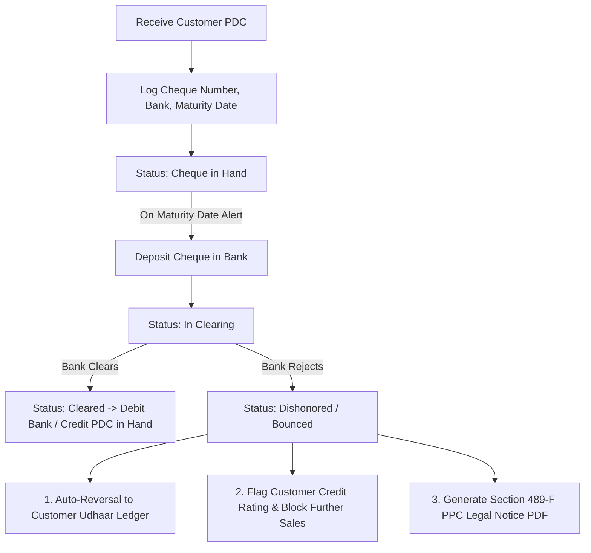
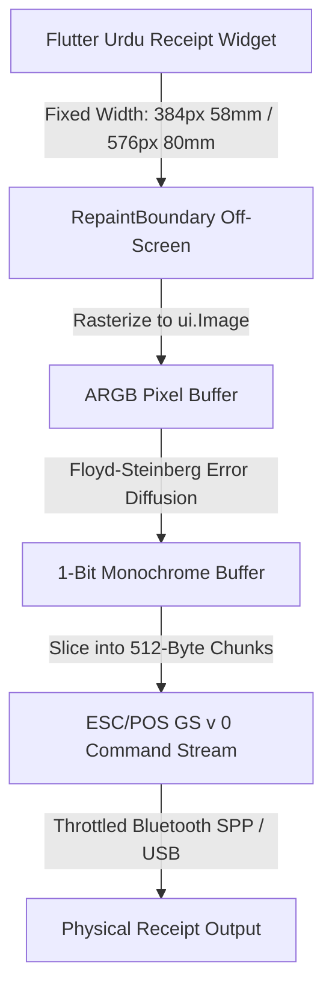
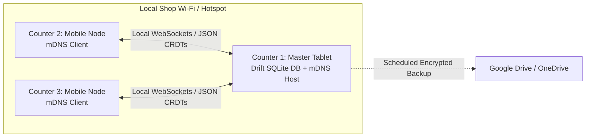

# Pakistan SME Billing & Business Management Platform (Vyapar Rival)
## Hardened Product Research, Regulatory Specifications & 2026 Production Blueprint

---

## 1. Executive Summary & Core Philosophy

### Product Vision
To engineer a hardened, offline-first, serverless business management mobile application built specifically for Pakistani Micro, Small, and Medium Enterprises (MSMEs). The platform directly bridges the structural, currency, and regulatory gaps left by foreign tools (e.g., India's Vyapar) and expensive cloud ERPs by offering native Pakistani tax compliance (FBR, Tajir Dost Scheme, provincial revenue boards), Urdu-first Nastaliq interface design, zero ongoing server hosting overhead, and complete operational resilience during electrical load-shedding and mobile network outages.

### Core Architectural Axioms
1. **100% Offline-First (No Cloud Dependency)**: Local SQLite engine (via Drift/SQLCipher) ensures sub-16ms POS checkout latency and immediate ledger updates with zero network latency.
2. **Serverless & User-Owned Data**: Eliminates vendor hosting expenses and privacy concerns. Backups are encrypted and synced directly to the user's personal Google Drive `appDataFolder`, Microsoft OneDrive `approot`, Dropbox, or local storage.
3. **2026 Pakistani Regulatory Compliance**: Built-in support for the FBR Digital Invoicing (DI API v1.12), Tajir Dost Fixed Tax (1% turnover regime under SRO 1166(I)/2026), Provincial Sales Tax on Services (PRA, SRB, KPRA, BRA), Section 3(1A) Further Tax, Section 73 Banking Channel rules, and SBP Raast P2M EMVCo payment standards.
4. **Zero-Cost WhatsApp Dispatch**: Utilizes native OS sharing intents (`whatsapp://send` + `share_plus`) to bypass Meta's USD-based Cloud API per-message fees, giving merchants 100% free, unlimited invoice and payment reminder messaging.
5. **Low-End Android Optimization**: Engineered for entry-level devices (2GB–3GB RAM Android Go devices like Infinix, Tecno, Itel, and Redmi) with stream pagination and memory-constrained rasterization to prevent Out-Of-Memory (OOM) crashes.
6. **Double-Entry Rigor Under the Hood**: Simple, intuitive single-entry UI workflows for shopkeepers that automatically compile into an immutable, mathematically balanced double-entry General Ledger in SQLite.

---

## 2. Competitive Landscape & Deep Market Analysis

### Detailed Competitor Matrix

| Competitor | Architecture | Target Segment | Key Strengths | Critical Gaps & Vulnerabilities in Pakistan |
| :--- | :--- | :--- | :--- | :--- |
| **Vyapar** | Offline / Hybrid Desktop + Mobile | India MSMEs | Fast UI, mature thermal printing, multi-industry templates | **Indian GST Centric** (CGST/SGST/IGST); no FBR/SRB/PRA support; INR currency; business data hosted on Indian servers; lacks native Urdu Nastaliq support; high subscription fee for Pakistani merchants. |
| **ManageKaro** | Cloud SaaS (Web + Mobile) | Pakistani SMEs & Wholesalers | Comprehensive ERP, accounting modules, local tax awareness | **Requires constant internet connectivity**; performance degrades during power/network outages; higher recurring subscription cost; complex interface for micro-shopkeepers. |
| **Udhaar Book / Udhaar.pk** | Cloud Mobile App | Micro-Merchants & Kiryana | Simple digital khata, wallet integrations, accessible mobile UI | **Weak POS invoicing capabilities**; lacks batch/expiry and IMEI tracking; basic inventory controls; limited customizable receipt printing. |
| **Splendid Accounts / Asaan Hisaab** | Cloud ERP | Mid-Sized Wholesalers & Distributors | Robust double-entry accounting, multi-warehouse support | Desktop/cloud heavy; steep learning curve; requires trained bookkeeper; expensive PKR pricing tiers. |
| **TallyPrime** | On-Premises Desktop | Traditional Accountants | Industry standard for ledger bookkeeping and audit trails | Complex keyboard-only legacy desktop UI; poor mobile experience; high upfront license fees. |
| **BoltSync / Karobar POS**| Local POS Software | Small Retailers | Fast counter checkout, receipt printing | Limited advanced inventory management; weak cloud backup ecosystem; minimal multilingual support. |

### Strategic Differentiation Matrix

```
┌────────────────────────────┬───────────────────────────────┬─────────────────────────────────────────────┐
│ Architectural Dimension    │ Vyapar / Cloud Competitors    │ Our App's Strategic Advantage               │
├────────────────────────────┼───────────────────────────────┼─────────────────────────────────────────────┤
│ Tax Compliance             │ Indian GST (CGST/SGST/IGST)   │ Native FBR (18%) + Tajir Dost (1%) + PSTS   │
│ Data Ownership & Privacy   │ Vendor's centralized cloud    │ 100% Local Storage + User's Own Cloud Drive │
│ Offline Reliability        │ Cloud-dependent sync routines │ Pure local SQLite engine (zero internet req)│
│ Currency & Fiscal Cycle    │ INR / April–March             │ PKR / July–June Fiscal Calendar             │
│ Language Support           │ English & Hindi               │ Complete Urdu (Nastaliq/Jameel) + English   │
│ WhatsApp Message Cost      │ Paid Cloud API credits ($/msg)│ 100% Free via Android Native OS Intent      │
│ Post-Dated Cheque Mgmt     │ Basic or absent               │ Full PDC Lifecycle + Section 489-F PPC Rec. │
│ Scale Barcode Support      │ Static EAN-13 only            │ Dynamic Price/Weight Embedded (EAN 20-29)   │
│ Payment Method Integration │ UPI / Razorpay                │ JazzCash, EasyPaisa, Raast, IBFT            │
│ Cost Structure             │ Vendor server maintenance fee │ Serverless client architecture (Lower cost) │
│ Low-End Device Resilience  │ High RAM / Web view lag       │ 60 FPS on 2GB RAM Android Go devices        │
└────────────────────────────┴───────────────────────────────┴─────────────────────────────────────────────┘
```

---

## 3. Pakistani SME Vertical Workflows & Bazaar Ground Realities

### A. Kiryana & General Stores (e.g., Jodia Bazaar Karachi, Akbari Mandi Lahore)
*   **Dual-Unit Conversions (Fractional Arithmetic)**: Items purchased in bulk sacks (*Bori*), crates (*Peti*), or master cartons are sold in *Kilograms*, *Pao* (250g), or individual *Packets*. The system uses integer-based base unit math (e.g., storing in grams) to prevent floating-point rounding errors.
*   **Weight & Price Embedded Barcode Parsing**: Direct decoding of variable-measure scale barcodes (EAN-13 with prefixes `20`–`29`) to extract PLU and grams/price instantaneously at the checkout counter.
*   **Credit (Udhaar) Recovery Cycles**: Daily and weekly collection reconciliation for neighborhood customers with automated WhatsApp reminder receipts.

### B. Pharmacies & Medical Stores (Drug Act Compliance)
*   **Batch & Expiry Controls**: Mandatory batch number, manufacturing date, and expiry date recording. Automated alerts for near-expiry inventory (30/60/90 days).
*   **Pricing Margins**: Maximum Retail Price (MRP) printing, wholesale trade price (TP), and regulated distributor discount calculations.
*   **Distributor Expiry Returns**: Tracking credit notes against expired inventory returned to pharmaceutical distributors.

### C. Mobile Phones & Electronics (e.g., Hall Road Lahore, Saddar Karachi)
*   **IMEI & Serial Number Tracking**: Dual IMEI recording per handset for warranty verification and PTA approval status logging.
*   **Secondhand & Trade-In Exchange**: Creating purchase vouchers from walk-in customers with CNIC capture for used mobile handset exchanges.

### D. Garments, Footwear & Wholesale Textiles (e.g., Faisalabad Cloth Market)
*   **3D Matrix Variants**: Item categorization by Size (S, M, L, XL), Color, and Fabric/Design Style under a single parent SKU.
*   **Thaan & Gaz Measurements**: Invoicing in fractional yards (*Gaz*) and meters alongside pre-packaged suits.

### E. Wholesale B2B Traders & Van Sales (e.g., Shah Alam Market Lahore)
*   **Post-Dated Cheques (PDC)**: Tracking cheques dated 15–60 days ahead with bank deposit reminders and dishonor legal tracking.
*   **Van / Rider Cash Collection**: Loading stock into delivery vans, tracking on-route sales, and reconciling cash collections vs returned stock at day's end.

### F. Small Manufacturing & Workshops (Light Assembly)
*   **Bill of Materials (BOM)**: Assembling raw materials into finished goods with automatic consumption of input components and overhead labor costing.

---

## 4. Pakistan Tax & Regulatory Specifications (2026 Mandates)

### A. Tajir Dost Scheme / Fixed Tax Asaan Scheme (SRO 1166(I)/2026)
*   **Target Segment**: Over 3.5 million retailers, shopkeepers, and small wholesalers with an annual gross turnover of up to **PKR 200 Million**.
*   **Flat Turnover Rate**: **1% annual tax** on total gross turnover.
*   **Minimum Baseline**: Minimum annual tax deposit of **PKR 25,000**.
*   **WHT Utility Offset**: Advance withholding tax already deducted on electricity bills, gas bills, and commercial leases is **100% adjustable** against the 1% final tax liability.
*   **Statutory Exemptions**: Registered traders are exempt from routine tax audits, withholding agent obligations, and mandatory Tier-1 POS integrations.
*   **App Integration**: Built-in *Tajir Dost 1% Tax & Utility WHT Ledger* that aggregates monthly gross sales and computes net tax payable after utility WHT deductions.

### B. Federal Sales Tax on Goods (FBR)
*   **Standard Rate**: **18%** on standard taxable supplies of goods.
*   **Concessionary / Reduced Rates**: 0%, 1%, 5%, 8%, 10%, 12% under 8th Schedule of the Sales Tax Act 1990.
*   **Zero-Rating (5th Schedule)**: Direct exports and designated exempt inputs.
*   **3rd Schedule Goods (Retail Price Taxation)**: Specific consumer goods (beverages, detergents, toiletries, electronics) where sales tax is charged on the printed Maximum Retail Price (MRP) rather than the transactional value.
*   **Section 3(1A) Further Tax (3%)**: A mandatory 3% additional sales tax charged when a registered seller supplies taxable goods to an unregistered buyer (excluding 3rd Schedule items).
*   **Section 73 (Banking Channel Rule)**: Invoices exceeding **Rs. 50,000** must be paid through banking channels (crossed cheque, bank transfer, IBFT, Raast) to allow input tax credit claims.

### C. Provincial Sales Tax on Services (PSTS)

```
┌──────────────────────────────────────┬───────────────┬───────────────────────────────────────────┐
│ Tax Authority                        │ Standard Rate │ Reduced / Sector-Specific Rates           │
├──────────────────────────────────────┼───────────────┼───────────────────────────────────────────┤
│ Punjab Revenue Authority (PRA)       │ 16%           │ 5% (telecom/IT), 8% (restaurant card pay) │
│ Sindh Revenue Board (SRB)            │ 15%           │ 3%–8% for specific construction & IT svcs │
│ Khyber Pakhtunkhwa Rev. Auth (KPRA)  │ 15%           │ 2%–5% slab options on services            │
│ Balochistan Revenue Authority (BRA)  │ 15%           │ 15% standard tariff                       │
│ Islamabad Capital Territory (ICT)    │ 15% – 16%     │ Handled under FBR service jurisdiction    │
└──────────────────────────────────────┴───────────────┴───────────────────────────────────────────┘
```

### D. Income Tax Withholding (Section 153 of Income Tax Ordinance 2001)
*   **Sale of Goods**: Filers (5%–5.5%), Non-Filers (10%–11%).
*   **Services**: Filers (9%–11%), Non-Filers (18%–22%).
*   **Contracts**: Filers (7.5%–8%), Non-Filers (15%–16%).
*   **Section 236G & 236H**: Advance income tax collection from wholesalers, distributors, and dealers at time of sale.

---

## 5. FBR Digital Invoicing Technical Specification (DI API v1.12)

### A. Integration Endpoints

| Environment | Action | Endpoint URL | Method |
| :--- | :--- | :--- | :--- |
| **Sandbox** | Validate Payload | `https://gw.fbr.gov.pk/di_data/v1/di/validateinvoicedata_sb` | POST |
| **Sandbox** | Post & Commit | `https://gw.fbr.gov.pk/di_data/v1/di/postinvoicedata_sb` | POST |
| **Production**| Validate Payload | `https://gw.fbr.gov.pk/di_data/v1/di/validateinvoicedata` | POST |
| **Production**| Post & Commit | `https://gw.fbr.gov.pk/di_data/v1/di/postinvoicedata` | POST |

### B. Network & IP Whitelisting Architecture for Mobile Clients
FBR/PRAL requires static outbound IP whitelisting for direct gateway requests. Since mobile devices have dynamic carrier IPs, the app utilizes an ultra-lightweight, zero-cost edge proxy (Cloudflare Worker / AWS Lambda with Elastic IP) or direct PRAL Licensed Integrator SDK to bridge the mobile client to FBR endpoints securely without storing business records on the proxy.

### C. Standard FBR Invoice JSON Payload Structure (v1.12)
```json
{
  "InvoiceType": "Sale Invoice",
  "InvoiceDate": "2026-08-20T14:30:00Z",
  "SellerNTN": "1234567-8",
  "SellerSTRN": "1234567890123",
  "BuyerNTN": "9876543-2",
  "BuyerName": "Al-Rehman Traders",
  "BuyerType": "Registered",
  "InvoiceItems": [
    {
      "ItemCode": "SKU-9901",
      "ItemDescription": "Cooking Oil 5L Can",
      "HSCode": "1512.1900",
      "Quantity": 10.0,
      "UnitOfMeasurement": "Can",
      "UnitPrice": 2500.0,
      "SalesTaxRate": 18.0,
      "SalesTaxAmount": 4500.0,
      "FurtherTaxRate": 0.0,
      "FurtherTaxAmount": 0.0,
      "Discount": 500.0,
      "TotalAmount": 29000.0
    }
  ],
  "TotalQuantity": 10.0,
  "TotalTaxableAmount": 25000.0,
  "TotalSalesTax": 4500.0,
  "TotalFurtherTax": 0.0,
  "TotalInvoiceAmount": 29000.0
}
```

### D. FBR DI API Error Code & Automated Recovery Matrix

| Error Code | Error Description | Cause | Automated Client Recovery Action |
| :--- | :--- | :--- | :--- |
| **`1001`** | Invalid NTN/STRN Format | Buyer NTN not 7-8 digits or incorrect checksum | Prompt user to verify buyer on Active Taxpayer List (ATL) |
| **`1002`** | Invalid HS Code | HS Code missing or not in 8-digit PCT tariff | Prompt category selector to resolve 8-digit HS code |
| **`1005`** | Duplicate Invoice Number | Invoice number previously posted for this NTN | Auto-increment internal company invoice sequence |
| **`1010`** | Sales Tax Math Mismatch | `SalesTaxAmount != TaxableAmount * Rate` | Auto-recalculate line-item tax and prompt user |
| **`1015`** | Beyond 72-Hour Window | Attempting to amend invoice past legal limit | Lock invoice and instruct user to issue Credit Note |
| **`5003`** | Gateway Timeout / PRAL Down| FBR servers unreachable during checkout | Queue in local `SyncQueue` for automated retry |

---

## 6. Under-the-Hood Double-Entry Accounting & SME Chart of Accounts

Although shopkeepers interact with a dead-simple single-entry UI (e.g., "+ Cash Sale", "- Expense"), the local SQLite persistence layer compiles every financial action into balanced, atomic double-entry journal records.

### A. Standard Pakistani SME Chart of Accounts (COA)

```
1000 - ASSETS
  ├── 1010 Cash in Hand (Cash Counter / Tijori)
  ├── 1020 Bank Accounts (Meezan, HBL, Bank Alfalah)
  ├── 1030 Mobile Wallets (JazzCash, EasyPaisa, Raast)
  ├── 1040 Accounts Receivable (Sundry Debtors / Khata)
  ├── 1050 Post-Dated Cheques in Hand (PDCs Received)
  └── 1060 Merchandise Inventory (Stock at Cost)
2000 - LIABILITIES
  ├── 2010 Accounts Payable (Sundry Creditors / Suppliers)
  ├── 2020 Post-Dated Cheques Issued (PDCs Payable)
  ├── 2030 FBR Sales Tax Payable
  └── 2040 Provincial Sales Tax Payable (PRA/SRB)
3000 - EQUITY
  ├── 3010 Owner's Capital Account
  └── 3020 Owner's Drawings (Personal Cash Withdrawals)
4000 - REVENUE
  ├── 4010 Sales Revenue (Gross Sales)
  ├── 4020 Sales Returns & Allowances (Debit Contra)
  └── 4030 Discounts Allowed (Debit Contra)
5000 - EXPENSES & COGS
  ├── 5010 Cost of Goods Sold (COGS)
  ├── 5020 Shop Rent & Lease
  ├── 5030 Electricity & Utilities (with Adjustable WHT)
  ├── 5040 Staff Salaries & Daily Wages
  └── 5050 Freight, Delivery & Carriage Inward
```

### B. Automated Journal Entry Generation Rules

```
┌──────────────────────────────────────┬─────────────────────────────────────────────────────────────┐
│ Business Event                       │ Automated Journal Entry                                     │
├──────────────────────────────────────┼─────────────────────────────────────────────────────────────┤
│ **Cash Sale (with 18% Tax)**         │ Dr. 1010 Cash in Hand                     (Total Amount)    │
│                                      │    Cr. 4010 Sales Revenue                 (Taxable Amount)  │
│                                      │    Cr. 2030 FBR Sales Tax Payable         (Tax Amount)      │
│                                      │ Dr. 5010 Cost of Goods Sold (COGS)        (Inventory Cost)  │
│                                      │    Cr. 1060 Merchandise Inventory         (Inventory Cost)  │
├──────────────────────────────────────┼─────────────────────────────────────────────────────────────┤
│ **Credit Sale (Udhaar Khata)**       │ Dr. 1040 Accounts Receivable (Customer)   (Total Amount)    │
│                                      │    Cr. 4010 Sales Revenue                 (Taxable Amount)  │
│                                      │    Cr. 2030 FBR Sales Tax Payable         (Tax Amount)      │
├──────────────────────────────────────┼─────────────────────────────────────────────────────────────┤
│ **Post-Dated Cheque Received (PDC)** │ Dr. 1050 Post-Dated Cheques in Hand       (Cheque Amount)   │
│                                      │    Cr. 1040 Accounts Receivable (Customer)(Cheque Amount)   │
├──────────────────────────────────────┼─────────────────────────────────────────────────────────────┤
│ **PDC Cleared at Bank**              │ Dr. 1020 Bank Account                     (Cheque Amount)   │
│                                      │    Cr. 1050 Post-Dated Cheques in Hand    (Cheque Amount)   │
├──────────────────────────────────────┼─────────────────────────────────────────────────────────────┤
│ **PDC Bounced (Sec 489-F PPC)**      │ Dr. 1040 Accounts Receivable (Customer)   (Cheque Amount)   │
│                                      │    Cr. 1050 Post-Dated Cheques in Hand    (Cheque Amount)   │
│                                      │ Dr. 1040 Accounts Receivable (Customer)   (Bank Bounce Fee) │
│                                      │    Cr. 1020 Bank Account                  (Bank Bounce Fee) │
└──────────────────────────────────────┴─────────────────────────────────────────────────────────────┘
```

---

## 7. Post-Dated Cheque (PDC) Management & Dishonor Legal Workflows

In major Pakistani wholesale markets (Shah Alam, Jodia Bazaar, Faisalabad), **60%–80% of wholesale volume** is conducted via Post-Dated Cheques (15 to 60 days maturity).



### Legal Enforcement Tools (Built-in)
*   **Section 489-F of the Pakistan Penal Code (PPC)**: Dishonest issuance of a cheque carries up to 3 years imprisonment. The app automatically tracks the official **Cheque Return Memo**, calculates the mandatory 30-day statutory notice deadline, and auto-generates a ready-to-sign **Demand Notice PDF** for legal recovery.
*   **Order 37 Code of Civil Procedure (CPC)**: Pre-fills summary suit documentation for fast-track judicial debt recovery in civil courts.

---

## 8. SBP Raast P2M (Person-to-Merchant) EMVCo QR Implementation

### A. EMVCo Merchant-Presented QR Code Specification

```
┌──────┬────────┬────────────────────────────────────────────────────────────────────────┐
│ Tag  │ Length │ Description & Value Format                                             │
├──────┼────────┼────────────────────────────────────────────────────────────────────────┤
│ 00   │ 02     │ Payload Format Indicator -> "01"                                       │
│ 01   │ 02     │ Point of Initiation Method -> "11" (Static) or "12" (Dynamic Bill)     │
│ 26   │ Var    │ Merchant Account Information (Raast Alias, IBAN, or Mobile Number)     │
│ 52   │ 04     │ Merchant Category Code (MCC) -> e.g., "5411" (Grocery / Retail)        │
│ 53   │ 03     │ Transaction Currency -> "586" (Pakistani Rupee - PKR)                  │
│ 54   │ Var    │ Transaction Amount -> e.g., "29000.00"                                 │
│ 58   │ 02     │ Country Code -> "PK"                                                   │
│ 59   │ Var    │ Merchant Name -> e.g., "AL-REHMAN TRADERS"                             │
│ 60   │ Var    │ Merchant City -> e.g., "LAHORE"                                        │
│ 62   │ Var    │ Additional Data Field (Subtag 01: Invoice Number Reference)            │
│ 63   │ 04     │ Checksum CRC-16 (CCITT-FALSE)                                          │
└──────┴────────┴────────────────────────────────────────────────────────────────────────┘
```

### B. Algorithmic CRC-16 Calculation (Dart Implementation)
```dart
int calculateCRC16CCITT(String data) {
  int crc = 0xFFFF; // Initial value
  final int polynomial = 0x1021; // Polynomial: x^16 + x^12 + x^5 + 1

  for (int i = 0; i < data.length; i++) {
    int byte = data.codeUnitAt(i);
    for (int j = 0; j < 8; j++) {
      bool bit = ((byte >> (7 - j)) & 1) == 1;
      bool c15 = ((crc >> 15) & 1) == 1;
      crc = (crc << 1) & 0xFFFF;
      if (c15 ^ bit) {
        crc ^= polynomial;
      }
    }
  }
  return crc & 0xFFFF;
}
```

---

## 9. Dynamic Scale Barcode Parsing & Keyboard Wedge Scanner

### A. EAN-13 Variable-Measure Barcode Parsing (Prefixes 20–29)
In grocery, butchery, fruit, and spice shops, electronic weighing scales (CAS, Digi, Rongta) print dynamic EAN-13 barcodes encoding item SKU and weight or price:

```
Example: 20 00125 01500 4
         │  │     │     └─ Checksum Digit
         │  │     └─────── Weight (01500 = 1.500 kg or 1500 grams)
         │  └───────────── Product PLU / Item Code (125)
         └──────────────── Variable-Measure Prefix (20)
```

```dart
class ScaleBarcodeParser {
  static ParsedScaleItem? parse(String rawCode) {
    if (rawCode.length != 13) return null;
    final prefix = rawCode.substring(0, 2);
    
    // GS1 Restricted Circulation Prefixes (20-29)
    if (['20', '21', '22', '28'].contains(prefix)) {
      final plu = rawCode.substring(2, 7);
      final rawValue = int.tryParse(rawCode.substring(7, 12)) ?? 0;
      
      // Determine if Weight-Embedded or Price-Embedded based on prefix config
      final isWeight = prefix == '20' || prefix == '21';
      return ParsedScaleItem(
        plu: plu,
        weightInGrams: isWeight ? rawValue : null,
        priceInRupees: !isWeight ? rawValue / 100.0 : null,
      );
    }
    return null;
  }
}
```

### B. Hardware Barcode Scanner "Keyboard Wedge" Listener
Physical USB/Bluetooth laser scanners type barcode characters at high speeds (10–30ms per character) followed by `Enter`. The app implements a global keyboard event stream that intercepts scanner bursts without requiring manual focus on a search input field:

```dart
class BarcodeScannerListener extends StatelessWidget {
  final Widget child;
  final Function(String barcode) onBarcodeScanned;
  final StringBuffer _buffer = StringBuffer();
  DateTime _lastKeystroke = DateTime.now();

  BarcodeScannerListener({required this.child, required this.onBarcodeScanned});

  @override
  Widget build(BuildContext context) {
    return Focus(
      autofocus: true,
      onKeyEvent: (node, event) {
        if (event is KeyDownEvent) {
          final now = DateTime.now();
          if (now.difference(_lastKeystroke).inMilliseconds > 100) {
            _buffer.clear(); // Reset buffer if keystrokes are slow (manual human typing)
          }
          _lastKeystroke = now;

          if (event.logicalKey == LogicalKeyboardKey.enter) {
            if (_buffer.isNotEmpty) {
              onBarcodeScanned(_buffer.toString());
              _buffer.clear();
              return KeyEventResult.handled;
            }
          } else if (event.character != null) {
            _buffer.write(event.character);
          }
        }
        return KeyEventResult.ignored;
      },
      child: child,
    );
  }
}
```

---

## 10. Hardware Architecture & Urdu ESC/POS Printing Engine

### The Problem with Thermal Printing in Pakistan
Standard thermal receipt printers (MPT-II, ZJ-5802, Sunmi, Xprinter, Rongta) only feature hardware ROM font tables for ASCII and Simplified Chinese. Passing raw UTF-8 Urdu strings outputs unreadable garbage characters (`???????`) due to lack of printer-resident Nastaliq ligatures, contextual letter-joining, and Right-to-Left (RTL) layout engines.

### The Solution: Off-Screen 1-Bit Dithered Rasterization



### Critical Printer Specifications & Buffer Throttling
1.  **Print Dimensions @ 203 DPI (8 dots/mm)**:
    *   **58mm Thermal Heads**: `384 dots` (48mm printable area).
    *   **80mm Thermal Heads**: `576 dots` (72mm printable area).
2.  **Bluetooth SPP Buffer Overrun Mitigation**: Thermal printers have tiny hardware UART buffers (typically 2KB–4KB). Blasting an entire 50KB raster image will overflow the printer's receive buffer, causing connection drops or half-printed receipts.
3.  **Chunking Engine**:
    *   Image payload is sliced into **512-byte packets**.
    *   A **25ms–50ms delay** is injected between chunk transmissions to permit the thermal head microcontroller to drain its internal buffer.

---

## 11. Low-End Device Memory & Performance Engineering (2GB RAM Android Go)

Many Pakistani Kiryana shopkeepers operate budget smartphones (Infinix Smart series, Tecno Pop series, Itel, Redmi A series) running Android Go with **2GB to 3GB of RAM**. To prevent Out-Of-Memory (OOM) process termination and UI stutter, the application enforces strict resource constraints:

```
┌──────────────────────────────┬─────────────────────────────────────────────────────────────┐
│ Engineering Area             │ Low-End Optimization Strategy                               │
├──────────────────────────────┼─────────────────────────────────────────────────────────────┤
│ **Database Querying**        │ Strict `LIMIT` and `OFFSET` pagination on all ledger lists  │
│ **Column Projection**        │ `SELECT id, name, sale_price` instead of full `SELECT *`    │
│ **Raster Memory Management** │ Immediate `.dispose()` on `ui.Image` and `ByteData` buffers │
│ **Image Decoding**           │ Set `cacheWidth: 384` on all receipt canvas widgets         │
│ **State Scoping**            │ Granular Riverpod `.select((s) => s.total)` providers       │
│ **SQLite Threading**         │ Native C-Bindings (`drift/native.dart`) with WAL mode       │
└──────────────────────────────┴─────────────────────────────────────────────────────────────┘
```

---

## 12. Multi-Device Local P2P Sync (Zero-Server Architecture)

For multi-counter retail stores and wholesale shops with 2–4 staff counters operating without internet:



### Protocol Mechanics
1.  **Zero-Config Discovery**: Counters discover each other on local Wi-Fi or phone hotspot using **mDNS / Bonjour** (`bonsoir` or `nsd`).
2.  **Embedded HTTP/WebSocket Server**: The designated master device runs a lightweight embedded Dart server (`shelf`).
3.  **Conflict-Free Ledger Resolution**:
    *   Invoices and payments are **Append-Only** immutable ledgers (no write-conflicts).
    *   Stock updates use **Delta-based operations** (`+X` or `-X` quantity adjustments) rather than absolute state overwrite.
    *   Entity updates (e.g., party address edit) resolve via **Hybrid Logical Clocks (HLC)** and Field-Level Last-Write-Wins (LWW).

---

## 13. Cryptographic Zero-Knowledge Backup & Disaster Recovery

### A. The `.pkbak` Encrypted Archive Format
To guarantee user privacy when syncing to Google Drive or local storage:

```
┌──────────────────────────────────────────────────────────────────────────────────┐
│ .pkbak FILE STRUCTURE                                                            │
├───────────────────┬──────────────┬───────────────────────────────────────────────┤
│ Header Tag        │ 8 Bytes      │ "PKBAK01\0" (Magic bytes & file version)      │
│ Salt & Nonce      │ 32 Bytes     │ Argon2id Salt (16B) + AES-GCM IV (16B)        │
│ Metadata (JSON)   │ Variable     │ Schema version, Company NTN, Timestamp        │
│ Encrypted Payload │ Variable     │ AES-256-GCM Encrypted compressed SQLite DB    │
│ Auth Tag          │ 16 Bytes     │ GCM Cryptographic Verification Tag            │
└───────────────────┴──────────────┴───────────────────────────────────────────────┘
```

### B. Startup Self-Healing & Integrity Checks
On every cold launch, the database runs `PRAGMA integrity_check(1)`. If SQLite detects page corruption caused by sudden battery failure during a write:
1.  The app rolls back to the last clean Write-Ahead Log (WAL) frame.
2.  If unrecoverable, the app alerts the merchant and offers one-tap restoration from the local cached snapshot (`.pkbak`) stored in internal app storage.

---

## 14. Technical Architecture & Database Schema

### Tech Stack Specification (2026)

| Layer | Package / Technology | Version | Purpose |
| :--- | :--- | :--- | :--- |
| **Core Framework** | Flutter SDK | `>=3.24.0` | Cross-platform client engine (Android-first). |
| **Language** | Dart | `>=3.5.0` | Null-safe business logic. |
| **Database Engine** | Drift (SQLite) | `^2.18.0` | Type-safe relational database with reactive Dart streams. |
| **Native DB Driver**| `sqlite3_flutter_libs` | `^0.5.24` | High-speed C-bindings for SQLite. |
| **Encryption** | `sqlcipher` | `^5.0.0` | 256-bit AES database encryption at rest. |
| **State Management**| `flutter_riverpod` | `^2.5.1` | Declarative, compile-safe dependency injection & state. |
| **Routing** | `go_router` | `^14.2.0` | URL/deep-link enabled declarative router. |
| **Cloud Connectors**| `googleapis`, `google_sign_in` | `^13.1.0` | Direct REST sync to user's personal Google Drive `appDataFolder`. |
| **Hardware Comms** | `flutter_blue_plus`, `blue_thermal_printer` | `^1.30.0` | Bluetooth thermal printer connection management. |
| **Barcode / QR** | `mobile_scanner`, `qr_flutter` | `^5.1.0` | Fast camera scanning & EMVCo/FBR QR drawing. |
| **Document Output** | `pdf`, `printing` | `^3.10.8` | Vector PDF document generation for A4/A5 invoices. |
| **Background Sync** | `workmanager` | `^0.5.2` | Headless background scheduled cloud backups. |
| **Localization** | `easy_localization` | `^3.0.7` | RTL Urdu (Nastaliq) and LTR English dynamic switching. |

---

### Core Relational Database Schema (Drift Definition)

```dart
// Drift Schema Definition (Dart DSL)

import 'package:drift/drift.dart';

class Companies extends Table {
  IntColumn get id => integer().autoIncrement()();
  TextColumn get name => text().withLength(min: 1, max: 100)();
  TextColumn get ntnStrn => text().nullable()();
  TextColumn get address => text().nullable()();
  TextColumn get phone => text().nullable()();
  TextColumn get currencyCode => text().withDefault(const Constant('PKR'))();
  IntColumn get fiscalStartMonth => integer().withDefault(const Constant(7))(); // July
  BoolColumn get isTajirDost => boolean().withDefault(const Constant(false))(); // 1% Turnover Regime
  DateTimeColumn get createdAt => dateTime().withDefault(currentDateAndTime)();
}

class Users extends Table {
  IntColumn get id => integer().autoIncrement()();
  IntColumn get companyId => integer().references(Companies, #id)();
  TextColumn get name => text().withLength(min: 1, max: 100)();
  TextColumn get role => text()(); // 'Owner', 'Cashier', 'Accountant', 'Viewer'
  TextColumn get pinHash => text()();
  DateTimeColumn get createdAt => dateTime().withDefault(currentDateAndTime)();
}

class Parties extends Table {
  IntColumn get id => integer().autoIncrement()();
  IntColumn get companyId => integer().references(Companies, #id)();
  TextColumn get name => text().withLength(min: 1, max: 100)();
  TextColumn get phone => text().nullable()();
  TextColumn get ntnCnic => text().nullable()();
  TextColumn get partyType => text()(); // 'Customer', 'Supplier', 'Both'
  RealColumn get creditLimit => real().withDefault(const Constant(0.0))();
  RealColumn get openingBalance => real().withDefault(const Constant(0.0))();
  RealColumn get currentBalance => real().withDefault(const Constant(0.0))();
  IntColumn get creditRatingScore => integer().withDefault(const Constant(100))(); // Decreases on bounced PDCs
  DateTimeColumn get updatedAt => dateTime().withDefault(currentDateAndTime)();
}

class Items extends Table {
  IntColumn get id => integer().autoIncrement()();
  IntColumn get companyId => integer().references(Companies, #id)();
  TextColumn get name => text().withLength(min: 1, max: 150)();
  TextColumn get barcode => text().nullable()();
  TextColumn get unit => text().withDefault(const Constant('Piece'))();
  TextColumn get hsCode => text().nullable()();
  RealColumn get salePrice => real()();
  RealColumn get purchasePrice => real().withDefault(const Constant(0.0))();
  RealColumn get taxRate => real().withDefault(const Constant(18.0))(); // 18% FBR standard
  RealColumn get stockQuantity => real().withDefault(const Constant(0.0))();
  RealColumn get minStockAlert => real().withDefault(const Constant(5.0))();
  BoolColumn get trackBatch => boolean().withDefault(const Constant(false))();
  BoolColumn get trackSerial => boolean().withDefault(const Constant(false))();
  BoolColumn get is3rdSchedule => boolean().withDefault(const Constant(false))(); // Tax on MRP
}

class Invoices extends Table {
  IntColumn get id => integer().autoIncrement()();
  IntColumn get companyId => integer().references(Companies, #id)();
  IntColumn get partyId => integer().nullable().references(Parties, #id)();
  TextColumn get invoiceNumber => text().withLength(min: 1, max: 50)();
  TextColumn get documentType => text()(); // 'Sale', 'Purchase', 'Estimate', 'Return', 'Challan'
  DateTimeColumn get invoiceDate => dateTime().withDefault(currentDateAndTime)();
  RealColumn get subtotal => real()();
  RealColumn get taxAmount => real().withDefault(const Constant(0.0))();
  RealColumn get furtherTaxAmount => real().withDefault(const Constant(0.0))();
  RealColumn get discountAmount => real().withDefault(const Constant(0.0))();
  RealColumn get totalAmount => real()();
  RealColumn get paidAmount => real().withDefault(const Constant(0.0))();
  TextColumn get paymentMode => text().withDefault(const Constant('Cash'))(); // 'Cash', 'Raast', 'JazzCash', 'Credit', 'PDC'
  TextColumn get fbrIrn => text().nullable()();
  TextColumn get fbrQrCode => text().nullable()();
  BoolColumn get isFbrSynced => boolean().withDefault(const Constant(false))();
  DateTimeColumn get createdAt => dateTime().withDefault(currentDateAndTime)();
}

class InvoiceItems extends Table {
  IntColumn get id => integer().autoIncrement()();
  IntColumn get invoiceId => integer().references(Invoices, #id)();
  IntColumn get itemId => integer().references(Items, #id)();
  RealColumn get quantity => real()();
  RealColumn get unitPrice => real()();
  RealColumn get taxRate => real()();
  RealColumn get taxAmount => real()();
  RealColumn get furtherTaxRate => real().withDefault(const Constant(0.0))();
  RealColumn get furtherTaxAmount => real().withDefault(const Constant(0.0))();
  RealColumn get discount => real().withDefault(const Constant(0.0))();
  RealColumn get totalAmount => real()();
  TextColumn get batchNumber => text().nullable()();
  DateTimeColumn get expiryDate => dateTime().nullable()();
  TextColumn get serialImei => text().nullable()();
}

class PostDatedCheques extends Table {
  IntColumn get id => integer().autoIncrement()();
  IntColumn get companyId => integer().references(Companies, #id)();
  IntColumn get partyId => integer().references(Parties, #id)();
  IntColumn get invoiceId => integer().nullable().references(Invoices, #id)();
  TextColumn get chequeNumber => text().withLength(min: 1, max: 50)();
  TextColumn get bankName => text()();
  RealColumn get amount => real()();
  DateTimeColumn get chequeDate => dateTime()(); // Maturity Date
  TextColumn get chequeType => text()(); // 'Received' (Inward), 'Issued' (Outward)
  TextColumn get status => text().withDefault(const Constant('InHand'))(); // 'InHand', 'Deposited', 'Cleared', 'Bounced'
  TextColumn get returnMemoRef => text().nullable()(); // If bounced
  DateTimeColumn get clearanceDate => dateTime().nullable()();
}

class StockMovements extends Table {
  IntColumn get id => integer().autoIncrement()();
  IntColumn get itemId => integer().references(Items, #id)();
  IntColumn get companyId => integer().references(Companies, #id)();
  RealColumn get quantityDelta => real()();
  TextColumn get movementType => text()(); // 'Sale', 'Purchase', 'Adjustment', 'Transfer'
  DateTimeColumn get movementDate => dateTime().withDefault(currentDateAndTime)();
}

class Payments extends Table {
  IntColumn get id => integer().autoIncrement()();
  IntColumn get companyId => integer().references(Companies, #id)();
  IntColumn get partyId => integer().references(Parties, #id)();
  IntColumn get invoiceId => integer().nullable().references(Invoices, #id)();
  RealColumn get amount => real()();
  TextColumn get paymentType => text()(); // 'Payment-In', 'Payment-Out'
  TextColumn get paymentMode => text()(); // 'Cash', 'Bank', 'Raast', 'JazzCash', 'PDC'
  TextColumn get transactionRef => text().nullable()();
  DateTimeColumn get paymentDate => dateTime().withDefault(currentDateAndTime)();
}

class Expenses extends Table {
  IntColumn get id => integer().autoIncrement()();
  IntColumn get companyId => integer().references(Companies, #id)();
  TextColumn get category => text()();
  RealColumn get amount => real()();
  TextColumn get paymentMode => text()();
  TextColumn get notes => text().nullable()();
  RealColumn get whtAdvanceTax => real().withDefault(const Constant(0.0))(); // Adjustable WHT on electricity/bills
  DateTimeColumn get expenseDate => dateTime().withDefault(currentDateAndTime)();
}

class SyncQueue extends Table {
  IntColumn get id => integer().autoIncrement()();
  TextColumn get entityType => text()(); // 'Invoice', 'Party', 'Item', 'Payment', 'PDC'
  IntColumn get entityId => integer()();
  TextColumn get mutationType => text()(); // 'INSERT', 'UPDATE', 'DELETE'
  TextColumn get payloadJson => text()();
  DateTimeColumn get timestamp => dateTime().withDefault(currentDateAndTime)();
  BoolColumn get isSynced => boolean().withDefault(const Constant(false))();
}
```

---

### Project Structure (Flutter)

```
lib/
├── main.dart                          # Application entrypoint & initialization
├── app.dart                           # Root MaterialApp & localization setup
├── core/
│   ├── constants/                     # Tax rates, currency defaults, app keys
│   ├── errors/                        # Custom exception & failure models
│   ├── localization/                  # En/Ur translations and RTL helpers
│   ├── theme/                         # Light/Dark material themes & styles
│   └── utils/                         # Calculators, formatting, date helpers
├── data/
│   ├── database/
│   │   ├── app_database.dart          # Drift database class & migrations
│   │   ├── daos/                      # Data Access Objects (Invoices, Items, Parties, PDCs)
│   │   └── tables/                    # Table definitions (SQL schema in Dart)
│   ├── models/                        # Business domain DTOs
│   └── repositories/                  # Implementation of data repositories
├── features/
│   ├── auth_lock/                     # App PIN / Biometric authentication
│   ├── backup_sync/                   # Google Drive, OneDrive, Local storage backup
│   ├── billing/                       # POS counter, invoice creation, print views
│   ├── company/                       # Company profile, NTN/STRN, Tajir Dost settings
│   ├── inventory/                     # Items, stock adjustment, scale barcode parser, batch/IMEI
│   ├── parties/                       # Customer/Supplier ledgers, credit tracking, PDC tracker
│   ├── reports/                       # P&L, Tajir Dost 1% tax, Day book, stock reports
│   └── subscription/                  # Paywall, tier validation, Play Billing
├── services/
│   ├── backup_service.dart            # Cloud Drive REST upload/download engine
│   ├── fbr_digital_service.dart       # PRAL API connector & QR payload generator
│   ├── pdf_invoice_service.dart       # A4/A5 PDF document generation
│   ├── printer_service.dart           # Bluetooth / USB ESC/POS thermal engine
│   └── share_service.dart             # Free WhatsApp URI & native OS share intents
└── shared/
    ├── providers/                     # Global Riverpod state providers
    └── widgets/                       # Reusable UI components (buttons, textfields)
```

---

## 15. Monetization & Subscription Strategy

### Packaging & Pricing Slabs (PKR)

```
┌────────────────────────┬──────────────────┬────────────────────────────────────────────────────────┐
│ Plan Tier              │ Price (PKR)      │ Included Capabilities & Unlocks                        │
├────────────────────────┼──────────────────┼────────────────────────────────────────────────────────┤
│ **Free Plan**          │ **Rs 0**         │ • Unlimited Invoices, Estimates & Quotations           │
│ (Lifetime Free)        │ (Forever)        │ • Customer & Supplier Udhaar / Khata Ledgers           │
│                        │                  │ • Basic Single-Store Inventory Management              │
│                        │                  │ • Cash Book, Expenses & Day Book                       │
│                        │                  │ • ESC/POS Thermal Printing & Free WhatsApp Share       │
│                        │                  │ • Manual Google Drive / OneDrive Backup                │
│                        │                  │ • Bilingual English & Urdu Interface                   │
│                        │                  │ • Tajir Dost 1% Turnover Tax Calculation               │
│                        │                  │ • Standard Software Watermark on Invoices              │
├────────────────────────┼──────────────────┼────────────────────────────────────────────────────────┤
│ **Silver Plan**        │ **Rs 1,999**     │ • Everything in Free Plan                              │
│                        │ / Year           │ • Removal of App Watermark on Receipts/PDFs            │
│                        │                  │ • Up to 3 Company / Shop Profiles                      │
│                        │                  │ • Automated Scheduled Daily Cloud Backups              │
│                        │                  │ • Post-Dated Cheques (PDC) Management Module           │
│                        │                  │ • Multi-tier Price Lists (Wholesale, Retail, VIP)      │
│                        │                  │ • Advanced P&L, Balance Sheet & Tax Summary Exports    │
├────────────────────────┼──────────────────┼────────────────────────────────────────────────────────┤
│ **Gold Plan**          │ **Rs 3,499**     │ • Everything in Silver Plan                            │
│ (Target Core SME)      │ / Year           │ • Multi-User Access with PIN Roles (Up to 5 Users)     │
│                        │                  │ • Batch Number & Expiry Date Management                │
│                        │                  │ • Serial Number & Dual-IMEI Tracking                   │
│                        │                  │ • Dynamic Scale Barcode Parsing (EAN 20–29)            │
│                        │                  │ • Multi-Godown / Warehouse Stock Transfers             │
│                        │                  │ • FBR Digital Invoicing Data Formatting & QR Code      │
│                        │                  │ • Local Wi-Fi Multi-Device Counter Sync                │
├────────────────────────┼──────────────────┼────────────────────────────────────────────────────────┤
│ **Platinum Plan**      │ **Rs 5,999**     │ • Everything in Gold Plan                              │
│ (Enterprises)          │ / Year           │ • Unlimited Users & Unlimited Companies                │
│                        │                  │ • Bill of Materials (BOM) & Assembly Manufacturing     │
│                        │                  │ • Van Sales & Rider Cash Collection Reconciliation     │
│                        │                  │ • Direct Live PRAL / FBR API Digital Invoicing Sync    │
│                        │                  │ • Priority Phone/WhatsApp Technical Onboarding         │
└────────────────────────┴──────────────────┴────────────────────────────────────────────────────────┘
```

---

## 16. Go-To-Market (GTM) & Distribution Strategy

1.  **Hardware Vendor Bundling (The Hardware Channel)**:
    *   Partner directly with wholesale computer and POS hardware vendors in major wholesale markets (e.g., Hafeez Centre & Hall Road Lahore, Uni Center & Techno City Karachi, Dubai Plaza Rawalpindi).
    *   Pre-package the mobile application with Bluetooth 58mm/80mm thermal printers and wireless barcode scanners.
2.  **Market Association Outreach**:
    *   Target local *Anjuman-e-Tajiran* (traders' associations) with live demonstration sessions and video walkthroughs in conversational Urdu.
3.  **Digital Organic Funnel**:
    *   Short-form video tutorials on TikTok, YouTube Shorts, and Facebook Reels demonstrating specific problems (e.g., "How to print Urdu receipts in 3 seconds", "How to track PDCs and bounced cheques", "How to calculate your 1% Tajir Dost tax").
    *   Direct WhatsApp community support groups for verified merchants.

---

## 17. Implementation Roadmap & Execution Milestones

```
┌──────────────────────────────────────────────────────────────────────────────────┐
│ MILESTONE TIMELINE                                                               │
├──────────────────────────┬───────────────────────────────────────────────────────┤
│ **Sprint 1: Core Engine**│ • Flutter project setup with Drift SQLite & Riverpod  │
│ (Weeks 1–4)              │ • POS Billing UI, Tax Calculator (18% FBR / Tajir 1%) │
│                          │ • ESC/POS Thermal Receipt Rasterizer (Urdu Nastaliq)  │
├──────────────────────────┼───────────────────────────────────────────────────────┤
│ **Sprint 2: Operations** │ • Parties (Udhaar Khata), Cash Book, & PDC Module     │
│ (Weeks 5–8)              │ • Google Drive / OneDrive direct serverless sync      │
│                          │ • Free WhatsApp OS Intent PDF invoice dispatch        │
├──────────────────────────┼───────────────────────────────────────────────────────┤
│ **Sprint 3: Advanced**   │ • Batch/Expiry, Serial/IMEI, & Scale Barcode parser   │
│ (Weeks 9–12)             │ • SBP Raast P2M EMVCo dynamic QR code generator       │
│                          │ • Local Wi-Fi P2P Multi-Counter sync                  │
├──────────────────────────┼───────────────────────────────────────────────────────┤
│ **Sprint 4: Compliance** │ • FBR DI API v1.12 Integration & Sandbox Testing      │
│ (Weeks 13–16)            │ • RevenueCat / Google Play Subscription paywalls      │
│                          │ • Beta launch in Lahore & Karachi wholesale markets   │
└──────────────────────────┴───────────────────────────────────────────────────────┘
```

---

## 18. Authentic References & Official Standards

1.  **FBR Digital Invoicing & Tajir Dost Regulations (2026)**:
    *   FBR Technical Documentation for DI API (V1.12): `https://fbr.gov.pk/`
    *   PRAL Digital Invoicing Sandbox Gateway: `https://gw.fbr.gov.pk/di_data/v1/di/postinvoicedata_sb`
    *   SRO 1166(I)/2026 Small Retailer Simplified Fixed Tax (Tajir Dost 1% Turnover Scheme)
    *   Sales Tax General Order (STGO 01 of 2026) Integration & 72-Hour Correction Rules
    *   Sales Tax Act 1990: Section 3 (18% Goods), Section 3(1A) (Further Tax), 3rd Schedule (MRP), Section 73 (Banking Channel).
2.  **Income Tax & Legal Recovery Frameworks**:
    *   Income Tax Ordinance 2001: Section 153 (WHT Rate Card), Section 236G & 236H (Advance Tax).
    *   Pakistan Penal Code (PPC) Section 489-F (Dishonor of Cheque Penalties) & CPC Order 37.
    *   Active Taxpayers List (ATL) Verification Gateway (IRIS FBR).
3.  **State Bank of Pakistan (SBP) Payment Protocols**:
    *   SBP Raast P2M (Person-to-Merchant) EMVCo Interoperable QR Specifications: `https://www.sbp.org.pk/psd/`
    *   SBP Raast Merchant Instant Settlement Regulations.
4.  **Provincial Revenue Authorities**:
    *   Punjab Revenue Authority (PRA) Service Sales Tax Tariff: `https://pra.punjab.gov.pk/`
    *   Sindh Revenue Board (SRB) Working Tariff & Tax Schedules: `https://srb.gos.pk/`
    *   Khyber Pakhtunkhwa Revenue Authority (KPRA) & Balochistan Revenue Authority (BRA) Schedules.
5.  **Hardware & Protocol Standards**:
    *   Epson ESC/POS Command Reference Manual (Raster Bit Image `GS v 0` Specifications).
    *   GS1 General Specifications: Variable Measure Item Identification (EAN-13 Prefixes 20–29).
    *   EMVCo Merchant-Presented QR Code (MPM) Specification v1.0 & CRC-16 CCITT Polynomial.
6.  **Drift & SQLite Engine Architecture**:
    *   Drift Reactive Persistence Framework Documentation: `https://drift.simonbinder.eu/`
